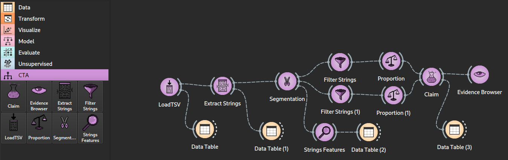

# CTA Orange
`CTA Orange` is an add-on for Orange Canvas created for Computational Text Analysis and based on [CTA Kernel](https://github.com/axanthos/cta_kernel). It adds 8 new widgets meant to propose an interface based edit of a CTA Kernel's workflow. At last, it is designed to make scientific claims about text analysis in a more practicable way. In the example (see the [example](https://github.com/ColinLug/cta_orange/tree/main/examples)), the workflow suggests that, in text messages, emojis-strings that are longer (like 4) have a tendency to be less diverse than the shorter ones (like 3). The workflow can estimate if such a claim is supported by the evidence.


## Requirements
- Python ≥ 3.12
- [uv](https://docs.astral.sh/uv/)
- [CTA Kernel](https://github.com/axanthos/cta_kernel)
## Installation
You can download the zip file. Extract it, and in the main folder where the `pyproject.toml` file is, open a terminal at that location and execute :
```bash
uv sync
```
## Running
Once installed, launch Orange and the widgets with:
```bash
uv run python -m Orange.canvas
```
## Documentation
Each widget hase its own documentation under [`docs/widgets`](docs/widgets/).
## Development context
These widgets have been created in the context of a UNIL course under the supervision of Prof. Xanthos who designed the `CTA Kernel` infrastructure.\
Some AI (Claude and Deepseek models) have been used for reviewing the code and the documentation. Nevertheless, the authors declare full responsibility of the created widgets and documentation.
