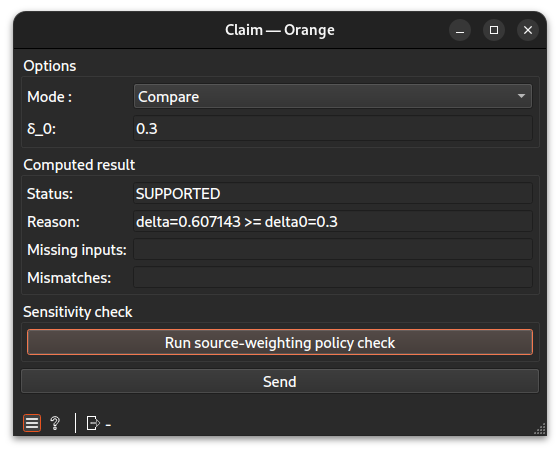

# Claim widget documentation

Determine whether a scientific claim is supported by the corpus evidence.
## Signals
### Inputs
- 1 or 2 `CTAData`\
The widget requires 1 or 2 `Proportion` widget(s) for input, depending on the mode set. If the mode is "Compare", then 2 `Proportion` widgets must be linked as input. Otherwise, if the mode is "Threshold", then only 1 is needed.
### Outputs
- `CTAData`\
A group of the ref to the evidence created, here a claim, and the session
- `Data Table`\
Only when running a sensitivity check
## Description
This is the final widget of the workflow. Its purpose is to determine whether a claim can be scientifically validated by the data and its sources.
### Interface

#### Options
- **Mode**: `Compare` or `Threshold`. Determines which of the two parameters below is used and how many upstream Proportion widgets are required.
- **δ₀ (delta)**: minimum margin required between the two scalar inputs in `Compare` mode. The claim is supported if the difference between the two scalars is strictly greater than δ₀.
- **θ (theta)**: threshold value used in `Threshold` mode. The claim is supported if the scalar input is strictly greater than θ.
- **Run source-weighting policy check**: launches a robustness sweep across source-weighting policies; results are shown as a Data Table output (see "Sensitivity check" below).
- **Send**: Compute and deliver the claim in `Computed Result`.
#### Computed Result
- **Status**: verdict of the claim check (`SUPPORTED`, `CONTRADICTED`, `UNDER_SUPPORTED` or `NOT_COMPUTABLE`), from the evidence payload.
- **Reason**: the reason behind the status, as reported by the kernel.
- **Missing inputs**: the list of inputs missing when the claim was evaluated.
- **Mismatches**: any compatibility mismatch detected between the two scalar inputs (e.g. incompatible scope or normalization policy).
#### Sensitivity check
The "Run source-weighting policy check" button launches a separate
robustness sweep, independent from the main Send button. It checks
how the claim's outcome would change under a grid of source-weighting
policies, and displays the result as a table on the Data Table output.
## Messages
### Informations
-  **Don't forget to provide another scalar.**: shown when the second scalar (`scalar_b`) is missing and the mode is "Compare".
### Errors
- **Upstream data are not connected.**: shown when no inputs as `scalar_a` has been linked.
- **Sweep failed**: shown when the robustness sweep raises an exception.
## Example
See the linked example [file](https://github.com/ColinLug/cta_orange/blob/main/examples/example_workflow.ows) for use.
## Technical notes
- The session (`CTASession`) is set via the `scalar_a` input.
- The parameters `theta` and `delta` are floating-point values adjustable in the interface.
- The robustness sweep creates a temporary node in the session (named `{node_id}_sweep`) and runs a `RobustnessSweepCapContinuum` operation.
