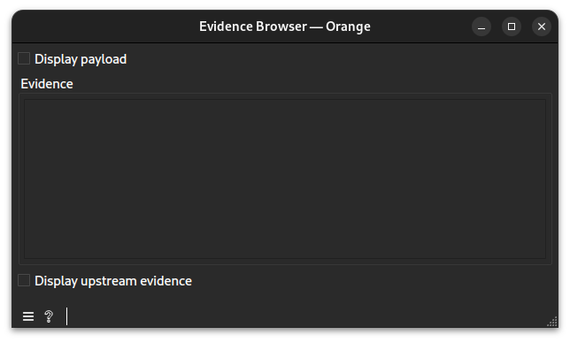
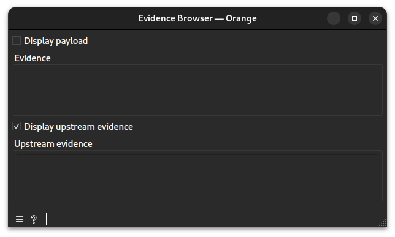

# Evidence Browser widget documentation

Let the user inspect evidence produced by upstream `CTA Orange` widgets.
## Signals
### Inputs
- 1 `CTAData`\
The widget requires one upstream `CTA Orange` widget as input.
### Outputs
- None
## Description
This is an exploratory widget. Its purpose is to display various pieces of evidence created by the software. When linked to a `CTA Orange` widget, it displays the output evidence with or without its payload. Additionally, upstream evidences can also be displayed.
### Interface

#### Evidence
- **Display payload**: `True` or `False`. Determines whether the payload should be displayed alongside the evidence metadata.
#### Upstream evidence
- **Display upstream evidence**: `True` or `False`. Determines whether upstream evidences should also be displayed.
## Messages
The widget does not display any messages.
## Example
See the linked example [file](https://github.com/ColinLug/cta_orange/blob/main/examples/example_workflow.ows) for use.
## Technical notes
- The main evidence display is updated automatically whenever new data is received.
- Evidence IDs larger than 40 characters are automatically truncated.
- Payloads larger than 2000 characters are automatically truncated in the display to maintain performance.
- When "Display upstream evidence" is enabled, all evidences in the current session except the main one are shown in a separate browser panel.
