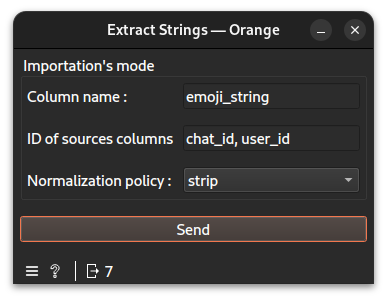

# Extract Strings widget documentation

Extract strings from a table column.
## Signals
### Inputs
- 1 `CTAData`\
The widget requires one upstream `LoadTSV` widget as input. It expects a table containing the data to process.
### Outputs
- `CTAData`\
A group of the ref to the evidence created, here a string store, and the session
- `Data Table`\
An Orange data table to visualize the created string store output.
## Description
This widget extracts strings from a specified column of a table imported via the `LoadTSV` widget and builds a string store. The string store can then be used by downstream widgets for further analysis.
### Interface

#### Importation's mode
- **Column Name**: A valid column name from which the strings will be extracted.
- **ID of sources columns**: Valids column names separated by commas (`,`), from which to extract the provenance of the strings.
- **Normalization policy**: `none`, `strip`, `lower`, `nfkc` or `emoji_strip_skin_tone`. Depending on the mode, the strings will be modified (or not) accordingly before being stored.
- **Send**: Compute and deliver the string store and the table to output.
## Messages
### Errors
- **Upstream data are not connected.**: Shown when no input has been linked.
- **Column(s) not found in upstream table:...**: Shown when the specified column name(s) could not be found in the upstream table.
## Example
See the linked example [file](https://github.com/ColinLug/cta_orange/blob/main/examples/example_workflow.ows) for use.
## Technical notes
- The `source_id_cols` field accepts multiple column names separated by commas (e.g., `col1, col2, col3`). Spaces are automatically stripped.
- The normalization policy is applied to each extracted string before storage.
- The output `Data Table` contains three columns: `string_id`, `string`, and `count`, representing each unique extracted string and its frequency.
- The widget validates that all specified columns exist in the upstream table before processing. If any column is missing, an error is displayed and no output is sent.
