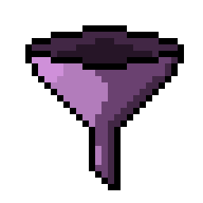
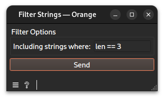

# Filter strings widget documentation

Filter strings with a given predicate.
## Signals
### Inputs
- 1 `CTAData`\
The widget demands 1 `Segmentation` widget for input.
### Outputs
- `CTAData`\
A group of the ref to the evidence created, here a filtered string store, and the session
## Description
This widget is intended to filter out the strings not following a certain predicate. It helps select some strings of the data to analyze or compare them.
### Interface

#### Filter Options
- **Including strings where**: A valid predicate to keep a certain type of strings. Valid predicates includes : `len`, `variety` or `count` variables.
- **Send**: Compute and deliver the string store to output.
## Messages
### Informations
- **No predicate configured yet**: shown when the predicate is empty.
### Errors
- **Upstream data are not connected.**: shown when no input has been linked.
- **Invalid predicate:...**: shown doesn't follow the standard grammar.
## Example
See the linked example [file](https://github.com/ColinLug/cta_orange/blob/main/examples/example_workflow.ows) for use.
