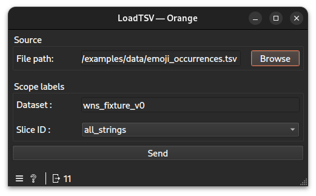

# Load widget documentation

Import a `.tsv` file and create a session.
## Signals
### Inputs
- None
### Outputs
- `CTAData`\
A group of the ref to the evidence created, here a table, and the session
- `Data Table`\
An Orange data table to visualize the imported `.tsv` file.
## Description
This widget is intended to be the first one of a workflow. It imports the data needed for analysis
### Interface

#### Source
- **File path**: A valid path to a `.tsv` file to import.
#### Scope labels
- **Dataset ID**: The identifier assigned to the imported dataset.
- **Slice ID**: An ID for the slice of the dataset. Currently, only `all_strings` is available.
- **Send**: Compute and deliver the table to the outputs.
## Messages
### Informations
- **Dataset ID is empty. Don't forget to annotate it.**: Shown when the dataset ID is empty.
### Errors
- **Please provide a valid path.**: Shown when the file could not be found at the specified path.
- **Please provide a TSV file.**: Shown when the selected file is not a `.tsv` file.
## Example
See the linked example [file](https://github.com/ColinLug/cta_orange/blob/main/examples/example_workflow.ows) for use.
## Technical notes
- The widget creates a new `CTASession` with the specified `profile_id` (`comhum_v0`) and scope (`dataset_id`, `slice_id`).
- The imported table is stored as evidence with the type `Table` in the session.
- The output `Data Table` is an Orange `Table` object created from the imported `.tsv` data, with columns and rows mapped directly.
- The widget validates that the file exists and has a `.tsv` extension before processing.
- The `slice_id` field is currently limited to `all_strings` (as a combo box with a single item).
- The widget uses `QFileDialog` to let users browse for files, and remembers the last used location.
