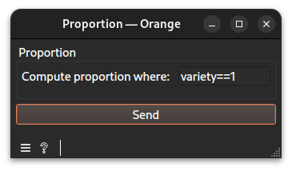

# Proportion widget documentation

Compute a proportion of strings satisfying a given predicate.
## Signals
### Inputs
- 1 `CTAData`\
The widget requires one upstream widget that exports a string view (e.g., `Filter Strings`) as input.
### Outputs
- `CTAData`\
A group of the ref to the evidence created, here a scalar, and the session
## Description
This widget computes the proportion of strings that satisfy a specified predicate. It is designed to produce scalar values that can be used to support or refute claims in downstream widgets (e.g., the `Claim` widget).
### Interface

#### Propotion
- **Compute proportion where**:  A valid predicate to compute the proportion of strings matching certain criteria. Valid predicates should use variables like `len`, `variety`, or `count`.
- **Send**: Compute and deliver the scalar proportion to the output.
## Messages
### Informations
- **No predicate configured yet**: Shown when the predicate field is empty.
### Errors
- **No upstream data connected.**: Shown when no input has been linked.
## Example
See the linked example [file](https://github.com/ColinLug/cta_orange/blob/main/examples/example_workflow.ows) for use.
## Technical notes
- The predicate is written in a custom DSL (Domain-Specific Language) and is parsed using `parse_predicate()` from the `cta_kernel.operators.predicate_dsl` module.
- If the predicate field is empty, the widget displays an information message and sends no output.
- The widget currently only supports `"mass"` mode (the `mode` setting is hardcoded and not exposed in the UI).
