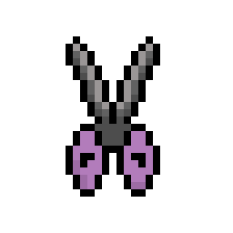
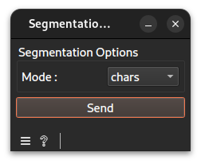
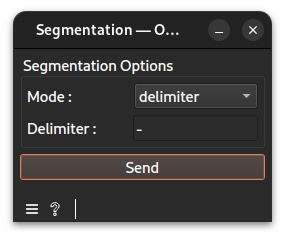

# Segmentation widget documentation

Segment strings into characters or using a delimiter.
## Signals
### Inputs
- 1 `CTAData`\
The widget requires one upstream `Extract Strings` widget as input.
### Outputs
- `CTAData`\
A group of the ref to the evidence created, here a string store, and the session.
## Description
This widget segments strings extracted from a string store. Segmentation can be performed either by splitting the strings into individual characters or by using a user-defined delimiter.
### Interface

#### Segmentation Options
- **Mode**: `chars` or `delimiter`. If `chars`, segments the strings into individual characters.
- **Delimiter**: When the mode is set to `delimiter`, this field specifies the character or string to use for splitting the strings.
- **Send**: Compute and deliver the segmented string view to the output.
## Messages
### Errors
- **No upstream data connected.**: Shown when no input has been linked.
- **The delimiter is empty, please use "chars" mode or provide a legitimate delimiter.**: hown when the mode is set to `delimiter` but the delimiter field is empty.
## Example
See the linked example [file](https://github.com/ColinLug/cta_orange/blob/main/examples/example_workflow.ows) for use.
## Technical notes
- The delimiter field is only visible and editable when `delimiter` mode is selected.
- The widget validates that the delimiter is not empty when `delimiter` mode is selected.
