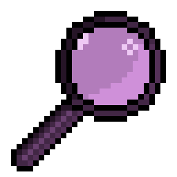
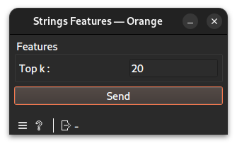

# String Features widget documentation

Filter some strings to preview them.
## Signals
### Inputs
- 1 `CTAData`\
The widget demands a widget exporting a string store for input.
### Outputs
- `Data Table`\
An Orange data table to visualize the strings.
## Description
This widget helps observing strings extracted from other widgets using a `top k` parameter.
### Interface

#### Features
- **Top K**: An integer of the number of strings to visualize.
- **Send**: Compute and deliver the string store and the table to output.
## Messages
### Errors
- **Upstream data are not connected.**: shown when no input has been linked.
- **Top k must be a positive integer.**: shown when the `top k` typed is empty or not a positive integer.
## Example
See the linked example [file](https://github.com/ColinLug/cta_orange/blob/main/examples/example_workflow.ows) for use.
